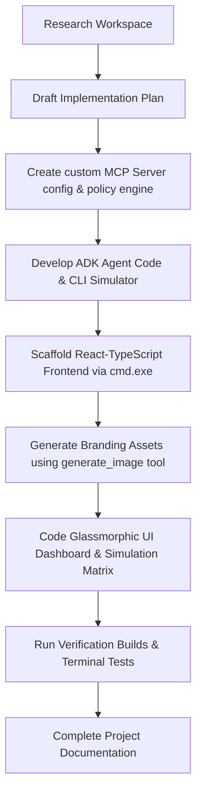

# AgriSustain AI: Smart Agriculture Multi-Agent System & Safe Execution Control Room

AgriSustain AI is an open-source, public utility system built for the **Agents for Good** track. It is designed to assist sustainable and smallholder farmers in optimizing soil chemistry and diagnosing crop diseases, while acting as a rigid, automated compliance gate to prevent chemical fertilizer overuse and ecological runoff near waterways.

This system demonstrates collaboration between modular AI specialists and a strict validation layer, ensuring that AI recommendations are safe, localized, and compliant with environmental standards.

---

## Key Architecture & Concepts

AgriSustain AI applies three core design concepts:

### 1. Google Vertex AI ADK Multi-Agent System
Rather than relying on a single large prompt, the system splits reasoning into a hierarchical **Agent Development Kit (ADK)** multi-agent team:
*   **AgriOrchestratorAgent (Parent)**: The entry agent that accepts queries from the farmer, queries sensor databases via MCP tools, and routes work to specialists.
*   **CropSoilAgent (Specialist)**: Focuses on soil pH levels, NPK nutrients, moisture indices, and recommends soil improvements or watering adjustments.
*   **PestDiseaseAgent (Specialist)**: Focuses on plant pathology, analyzing physical symptoms to diagnose pests and crop diseases.
*   **SafetyEnforcerAgent (Guardrail Auditor)**: The compliance officer. It intercepts all chemical proposals, submits them to the MCP validation tools, and if blocked, overrides them with organic fallbacks.

### 2. Custom Model Context Protocol (MCP) Server
AgriSustain decouples its data access from the language models by implementing the **Model Context Protocol (MCP)**:
*   It exposes standardised tool endpoints (`get_soil_telemetry`, `propose_treatment`, `get_safety_logs`) over standard input/output (Stdio).
*   Any MCP-compliant LLM or IDE can query live zone telemetry and submit chemical applications for validation without direct database drivers.

### 3. Verification & Safe Execution Security
To prevent prompt injection overrides or hazardous actions, the system enforces two layers of security:
*   **Input Sanitization**: Validates parameters (e.g. zone names, dosage bounds, string character sets) prior to parsing.
*   **Execution Policies (`chemical-policy.json`)**: An environmental safety policy engine. It blocks banned substances (e.g., Paraquat, DDT) and evaluates pesticide applications against water-body buffer buffers (e.g., blocking copper sulfate within 30 meters of a river stream to prevent fish toxicity).

---

## Project Structure

```
Capstone/
├── README.md                          <- This document
├── mcp-server/                        <- Custom Model Context Protocol Server
│   ├── package.json                   <- Server dependencies & scripts
│   ├── tsconfig.json                  <- TypeScript configuration
│   ├── src/
│   │   ├── index.ts                   <- MCP bootloader using Stdio transport
│   │   ├── tools.ts                   <- Tool schemas and execute router
│   │   ├── security.ts                <- Input sanitation & chemical policy evaluator
│   │   └── data.ts                    <- Telemetry & crop mock database
│   └── config/
│       └── chemical-policy.json       <- Editable safety thresholds & buffer bounds
├── agents/                            <- Google ADK Multi-Agent Package
│   ├── package.json
│   ├── tsconfig.json
│   └── src/
│       ├── orchestrator.ts            <- Multi-agent supervisor coordinator
│       ├── crop_soil.ts               <- Nutrient & pH specialist agent
│       ├── pest_disease.ts            <- Pathology & pest specialist agent
│       ├── safety_enforcer.ts         <- Guardrail interceptor & compliance audit agent
│       └── simulate.ts                <- Command-line end-to-end workflow runner
└── frontend/                          <- Premium Glassmorphic Dashboard
    ├── package.json
    ├── index.html
    └── src/
        ├── main.tsx
        ├── App.tsx                    <- Live agent simulation state machine & interactive panels
        ├── App.css                    <- Dark-mode CSS styling tokens and micro-animations
        └── assets/
            └── logo.png               <- Generated project branding asset
```

---

## Setup & Running the Code

### Prerequisites
Make sure you have [Node.js](https://nodejs.org/) (v18+) installed.

### 1. Build and Run the MCP Server
```bash
cd mcp-server
npm install
npm run build
npm start
```
The MCP server will launch and listen on standard input/output (stdin/stdout), ready to connect to any MCP client.

### 2. Compile and Run the Multi-Agent Simulator
```bash
cd agents
npm install
npm run build
npm run simulate
```
This runs three test scenarios on the command line:
1.  **Safe Case**: Proposes a mild copper fungicide treatment in Zone-A, which is 55m from the water body (buffer limit is 30m). **Cleared.**
2.  **Buffer Violation Case**: Proposes a chemical treatment in Zone-B, which is only 8m from a local water stream. **SafetyEnforcer blocks the tool and triggers an organic baking soda replacement.**
3.  **Banned Chemical Injection Case**: Proposes Paraquat herbicide. **Globally blocked and replaced with mechanical weeding.**

### 3. Launch the Interactive Glassmorphic Frontend
```bash
cd frontend
npm install
npm run dev
```
Open the local URL (e.g., `http://localhost:5173`) in your browser to interact with the premium control panel dashboard.

---

## UI Layout Design & Aesthetics

The UI dashboard is styled as a state-of-the-art smart agriculture control room:
*   **Deep Obsidian Gradient**: Deep dark backgrounds (`#0b0f14` to `#152222`) paired with glowing neon-emerald accents (`#10b981`).
*   **Glassmorphism Panels**: Semi-transparent card panels with `backdrop-filter: blur(12px)` and thin borders, creating depth.
*   **Agent Pipeline Pipeline**: Visual nodes that flash and highlight dynamically as the request passes from the *Orchestrator* to the *Specialists* and finally to the *Safety Enforcer*.
*   **MCP Security Terminal**: A simulated log terminal detailing each request's input sanitization parameters, rule checks, and safety execution codes in real-time.

---

## ANTIGRAVITY Demo Explanation (End-to-End Workflow)

This project template was built end-to-end by **Antigravity**, a pairs-programming AI coding assistant. The development workflow proceeded as follows:



1.  **Requirement Alignment**: Verified workspace parameters and established a custom policy configuration (`chemical-policy.json`) mapping out chemical boundaries.
2.  **Safety Engine Development**: Programmed input sanitizers in `security.ts` to block standard string hacks and check database zone parameters.
3.  **ADK Team Coding**: Designed separate agents with distinct system instructions (Crop & Soil agronomist, Pathology botanist, and Environmental safety auditor) and coordinated them via an Orchestrator.
4.  **UI Scaffolding**: Built a Vite React environment, avoiding standard Tailwind dependencies to deliver tailored, high-performance vanilla CSS glassmorphic controls.
5.  **Asset Generation**: Generated and placed `logo.png` to give the dashboard a polished eco-tech appearance.
6.  **Validation Check**: Executed build compilations across the entire workspace, ensuring zero errors, and ran the CLI simulator to verify safety fallbacks.
# omnipilot-AI

# omnipilot-AI

# omnipilot-AI

# omnipilot-AI

# omnipilot-AI

# omnipilot-AI

# omnipilot-AI

# omnipilot-AI

# omnipilot-AI

